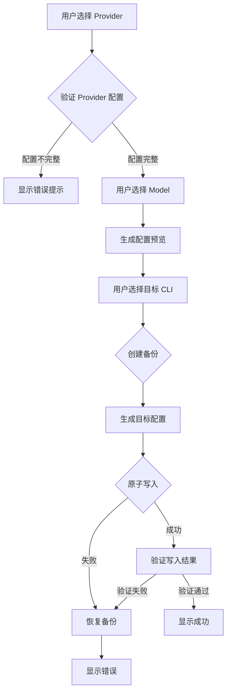

# Design Document: CC-Switch Integration (CLI 工具导出)

## Overview

本设计文档描述如何将 CC-Switch 的核心配置同步逻辑集成到 OpenCode Config Manager 中 实现从 OpenCode 配置导出到 Claude Code、Codex CLI、Gemini CLI 的功能。

### 设计目标

1. **模块化设计**：将 CLI 导出功能作为独立模块 便于维护和扩展
2. **复用 CC-Switch 逻辑**：直接移植 CC-Switch 的配置写入逻辑 确保兼容性
3. **安全可靠**：原子写入、自动备份、配置验证
4. **用户友好**：清晰的界面、配置预览、错误提示

## Architecture

### 模块结构

```
opencode_config_manager_fluent.py
├── 现有模块
│   ├── UIConfig (UI 配置)
│   ├── AuthManager (认证管理)
│   ├── NativeProviderConfig (原生 Provider 配置)
│   └── ...
│
└── 新增模块 (CLI Export)
    ├── CLIExportManager (核心导出管理器)
    │   ├── detect_cli_tools() - CLI 工具检测
    │   ├── validate_provider() - Provider 配置验证
    │   ├── export_to_claude() - Claude Code 导出
    │   ├── export_to_codex() - Codex CLI 导出
    │   ├── export_to_gemini() - Gemini CLI 导出
    │   └── batch_export() - 批量导出
    │
    ├── CLIConfigGenerator (配置生成器)
    │   ├── generate_claude_config() - 生成 Claude 配置
    │   ├── generate_codex_config() - 生成 Codex 配置
    │   └── generate_gemini_config() - 生成 Gemini 配置
    │
    ├── CLIConfigWriter (配置写入器)
    │   ├── write_claude_settings() - 写入 Claude settings.json
    │   ├── write_codex_auth() - 写入 Codex auth.json
    │   ├── write_codex_config() - 写入 Codex config.toml
    │   ├── write_gemini_env() - 写入 Gemini .env
    │   └── write_gemini_settings() - 写入 Gemini settings.json
    │
    ├── CLIBackupManager (备份管理器)
    │   ├── create_backup() - 创建备份
    │   ├── restore_backup() - 恢复备份
    │   └── cleanup_old_backups() - 清理旧备份
    │
    └── CLIExportPage (UI 页面)
        ├── Provider 选择区域
        ├── Model 选择区域
        ├── CLI 工具状态区域
        ├── 配置预览区域
        └── 导出操作区域
```

### 数据流



## Components and Interfaces

### 1. CLIExportManager (核心导出管理器)

```python
class CLIExportManager:
    """CLI 工具导出管理器"""
    
    def __init__(self):
        self.config_generator = CLIConfigGenerator()
        self.config_writer = CLIConfigWriter()
        self.backup_manager = CLIBackupManager()
    
    def detect_cli_tools(self) -> Dict[str, CLIToolStatus]:
        """检测已安装的 CLI 工具
        
        Returns:
            {
                "claude": CLIToolStatus(installed=True, path="~/.claude/"),
                "codex": CLIToolStatus(installed=False, path=None),
                "gemini": CLIToolStatus(installed=True, path="~/.gemini/")
            }
        """
        pass
    
    def validate_provider(self, provider: Dict) -> ValidationResult:
        """验证 Provider 配置完整性
        
        Args:
            provider: OpenCode Provider 配置
            
        Returns:
            ValidationResult(valid=True/False, errors=[...])
        """
        pass
    
    def export_to_claude(self, provider: Dict, model: str) -> ExportResult:
        """导出到 Claude Code"""
        pass
    
    def export_to_codex(self, provider: Dict, model: str) -> ExportResult:
        """导出到 Codex CLI"""
        pass
    
    def export_to_gemini(self, provider: Dict, model: str) -> ExportResult:
        """导出到 Gemini CLI"""
        pass
    
    def batch_export(self, provider: Dict, models: Dict[str, str], 
                     targets: List[str]) -> BatchExportResult:
        """批量导出到多个 CLI 工具"""
        pass
```

### 2. CLIConfigGenerator (配置生成器)

```python
class CLIConfigGenerator:
    """CLI 配置生成器 - 将 OpenCode 配置转换为各 CLI 工具格式"""
    
    def generate_claude_config(self, provider: Dict, model: str) -> Dict:
        """生成 Claude Code settings.json 配置
        
        输出格式:
        {
            "env": {
                "ANTHROPIC_BASE_URL": "https://api.example.com",
                "ANTHROPIC_AUTH_TOKEN": "sk-xxx",
                "ANTHROPIC_MODEL": "claude-sonnet-4-20250514",
                "ANTHROPIC_DEFAULT_HAIKU_MODEL": "...",
                "ANTHROPIC_DEFAULT_SONNET_MODEL": "...",
                "ANTHROPIC_DEFAULT_OPUS_MODEL": "..."
            }
        }
        """
        pass
    
    def generate_codex_auth(self, provider: Dict) -> Dict:
        """生成 Codex auth.json 配置
        
        输出格式:
        {
            "OPENAI_API_KEY": "sk-xxx"
        }
        """
        pass
    
    def generate_codex_config(self, provider: Dict, model: str) -> str:
        """生成 Codex config.toml 配置
        
        输出格式 (TOML 字符串):
        model_provider = "newapi"
        model = "gpt-4o"
        model_reasoning_effort = "high"
        disable_response_storage = true
        
        [model_providers.newapi]
        name = "NewAPI"
        base_url = "https://api.example.com/v1"
        wire_api = "responses"
        requires_openai_auth = true
        """
        pass
    
    def generate_gemini_env(self, provider: Dict, model: str) -> Dict[str, str]:
        """生成 Gemini .env 配置
        
        输出格式:
        {
            "GOOGLE_GEMINI_BASE_URL": "https://api.example.com",
            "GEMINI_API_KEY": "sk-xxx",
            "GEMINI_MODEL": "gemini-2.5-pro"
        }
        """
        pass
    
    def generate_gemini_settings(self, auth_type: str = "gemini-api-key") -> Dict:
        """生成 Gemini settings.json 中的 security 配置
        
        输出格式:
        {
            "security": {
                "auth": {
                    "selectedType": "gemini-api-key"
                }
            }
        }
        """
        pass
```

### 3. CLIConfigWriter (配置写入器)

```python
class CLIConfigWriter:
    """CLI 配置写入器 - 原子写入配置文件"""
    
    @staticmethod
    def get_claude_dir() -> Path:
        """获取 Claude 配置目录 (~/.claude/)"""
        return Path.home() / ".claude"
    
    @staticmethod
    def get_codex_dir() -> Path:
        """获取 Codex 配置目录 (~/.codex/)"""
        return Path.home() / ".codex"
    
    @staticmethod
    def get_gemini_dir() -> Path:
        """获取 Gemini 配置目录 (~/.gemini/)"""
        return Path.home() / ".gemini"
    
    def atomic_write_json(self, path: Path, data: Dict) -> None:
        """原子写入 JSON 文件
        
        1. 写入临时文件 (path.tmp.timestamp)
        2. 验证 JSON 格式
        3. 重命名替换原文件
        """
        pass
    
    def atomic_write_text(self, path: Path, content: str) -> None:
        """原子写入文本文件 (用于 TOML/.env)"""
        pass
    
    def write_claude_settings(self, config: Dict, merge: bool = True) -> None:
        """写入 Claude settings.json
        
        Args:
            config: 要写入的配置
            merge: 是否与现有配置合并 (保留非 env 字段)
        """
        pass
    
    def write_codex_auth(self, auth: Dict) -> None:
        """写入 Codex auth.json"""
        pass
    
    def write_codex_config(self, config_toml: str, merge: bool = True) -> None:
        """写入 Codex config.toml
        
        Args:
            config_toml: TOML 格式配置字符串
            merge: 是否保留现有的 MCP 配置等
        """
        pass
    
    def write_gemini_env(self, env_map: Dict[str, str]) -> None:
        """写入 Gemini .env 文件
        
        格式: KEY=VALUE (每行一个)
        """
        pass
    
    def write_gemini_settings(self, security_config: Dict, merge: bool = True) -> None:
        """写入 Gemini settings.json
        
        Args:
            security_config: security.auth.selectedType 配置
            merge: 是否保留现有的 mcpServers 等字段
        """
        pass
    
    def set_file_permissions(self, path: Path, mode: int = 0o600) -> None:
        """设置文件权限 (Unix only)"""
        pass
```

### 4. CLIBackupManager (备份管理器)

```python
class CLIBackupManager:
    """CLI 配置备份管理器"""
    
    BACKUP_DIR = Path.home() / ".opencode-backup"
    MAX_BACKUPS = 5
    
    def create_backup(self, cli_type: str) -> Optional[Path]:
        """创建指定 CLI 工具的配置备份
        
        Args:
            cli_type: "claude" | "codex" | "gemini"
            
        Returns:
            备份目录路径 如 ~/.opencode-backup/claude_20250119_143052/
        """
        pass
    
    def restore_backup(self, backup_path: Path, cli_type: str) -> bool:
        """从备份恢复配置"""
        pass
    
    def list_backups(self, cli_type: str) -> List[BackupInfo]:
        """列出指定 CLI 工具的所有备份"""
        pass
    
    def cleanup_old_backups(self, cli_type: str) -> None:
        """清理旧备份 保留最近 MAX_BACKUPS 个"""
        pass
```

## Data Models

### CLIToolStatus (CLI 工具状态)

```python
@dataclass
class CLIToolStatus:
    """CLI 工具安装状态"""
    cli_type: str           # "claude" | "codex" | "gemini"
    installed: bool         # 是否已安装
    config_dir: Optional[Path]  # 配置目录路径
    has_config: bool        # 是否已有配置文件
    version: Optional[str]  # CLI 版本 (如果可检测)
```

### ValidationResult (验证结果)

```python
@dataclass
class ValidationResult:
    """Provider 配置验证结果"""
    valid: bool
    errors: List[str]       # 错误信息列表
    warnings: List[str]     # 警告信息列表
```

### ExportResult (导出结果)

```python
@dataclass
class ExportResult:
    """单个 CLI 工具导出结果"""
    success: bool
    cli_type: str
    backup_path: Optional[Path]
    error_message: Optional[str]
    files_written: List[Path]
```

### BatchExportResult (批量导出结果)

```python
@dataclass
class BatchExportResult:
    """批量导出结果"""
    total: int
    successful: int
    failed: int
    results: List[ExportResult]
```

### BackupInfo (备份信息)

```python
@dataclass
class BackupInfo:
    """备份信息"""
    path: Path
    cli_type: str
    created_at: datetime
    files: List[str]
```


## Correctness Properties

*A property is a characteristic or behavior that should hold true across all valid executions of a system-essentially, a formal statement about what the system should do. Properties serve as the bridge between human-readable specifications and machine-verifiable correctness guarantees.*

基于 prework 分析 以下是本功能的核心正确性属性：

### Property 1: Claude 配置生成完整性
*For any* valid OpenCode Provider 配置 (包含 baseURL 和 apiKey） 生成的 Claude settings.json 配置应包含所有必需的 env 字段：ANTHROPIC_BASE_URL、ANTHROPIC_AUTH_TOKEN、ANTHROPIC_MODEL。
**Validates: Requirements 2.1, 2.3**

### Property 2: Codex 配置生成完整性
*For any* valid OpenCode Provider 配置 生成的 Codex 配置应满足：
- auth.json 包含有效的 OPENAI_API_KEY
- config.toml 是有效的 TOML 格式 包含 model_provider、model、base_url 字段
**Validates: Requirements 3.1, 3.2, 3.3**

### Property 3: Gemini 配置生成完整性
*For any* valid OpenCode Provider 配置 生成的 Gemini 配置应满足：
- .env 文件包含 GOOGLE_GEMINI_BASE_URL、GEMINI_API_KEY、GEMINI_MODEL
- settings.json 包含 security.auth.selectedType 字段
**Validates: Requirements 4.1, 4.2**

### Property 4: 配置合并保留性
*For any* 现有 CLI 配置文件 (包含非 Provider 相关字段如 mcpServers） 导出操作后这些字段应保持不变。
**Validates: Requirements 2.4, 3.4, 4.4**

### Property 5: 备份数量限制
*For any* CLI 工具 在执行多次导出后 备份目录中应最多保留 5 个备份文件。
**Validates: Requirements 5.4**

### Property 6: 批量导出容错性
*For any* 批量导出操作 如果其中一个 CLI 工具导出失败 其他 CLI 工具的导出应继续执行并完成。
**Validates: Requirements 6.4**

### Property 7: 配置验证准确性
*For any* 导出的配置文件 验证功能应能正确识别：
- 文件是否存在
- JSON/TOML 格式是否有效
- 必需字段是否存在
**Validates: Requirements 7.2, 7.3**

### Property 8: Provider 配置完整性检查
*For any* OpenCode Provider 配置 如果缺少 baseURL 或 apiKey 验证应返回失败并包含具体错误信息。
**Validates: Requirements 15.1, 15.2, 15.3**

### Property 9: 配置预览一致性
*For any* Provider 和 Model 选择 预览生成的配置应与实际导出的配置内容完全一致。
**Validates: Requirements 13.1, 13.2**

### Property 10: 原子写入安全性
*For any* 配置写入操作 如果写入过程中发生错误 原有配置文件应保持不变 (不会出现半写状态）。
**Validates: Requirements 14.1, 14.2**


## Error Handling

### 错误类型

```python
class CLIExportError(Exception):
    """CLI 导出错误基类"""
    pass

class ProviderValidationError(CLIExportError):
    """Provider 配置验证错误"""
    def __init__(self, missing_fields: List[str]):
        self.missing_fields = missing_fields
        super().__init__(f"Provider 配置不完整: 缺少 {', '.join(missing_fields)}")

class ConfigWriteError(CLIExportError):
    """配置写入错误"""
    def __init__(self, path: Path, reason: str):
        self.path = path
        self.reason = reason
        super().__init__(f"写入配置失败 ({path}): {reason}")

class ConfigParseError(CLIExportError):
    """配置解析错误"""
    def __init__(self, path: Path, format_type: str, reason: str):
        self.path = path
        self.format_type = format_type
        self.reason = reason
        super().__init__(f"解析 {format_type} 配置失败 ({path}): {reason}")

class BackupError(CLIExportError):
    """备份操作错误"""
    pass

class RestoreError(CLIExportError):
    """恢复操作错误"""
    pass
```

### 错误处理策略

1. **Provider 验证失败**
   - 显示具体缺少的字段
   - 提供"修复配置"按钮跳转到编辑页面
   - 阻止导出操作

2. **配置写入失败**
   - 自动恢复备份
   - 显示详细错误信息
   - 记录错误日志

3. **批量导出部分失败**
   - 继续执行其他导出
   - 汇总所有错误
   - 显示成功/失败统计

4. **备份/恢复失败**
   - 显示警告但不阻止操作
   - 提供手动备份选项

## Testing Strategy

### 单元测试

1. **配置生成器测试**
   - 测试各种 Provider 配置的转换
   - 测试边界情况 (空值、特殊字符）
   - 测试模型映射逻辑

2. **配置写入器测试**
   - 测试原子写入逻辑
   - 测试配置合并逻辑
   - 测试文件权限设置

3. **备份管理器测试**
   - 测试备份创建和恢复
   - 测试备份清理逻辑

### 属性测试 (Property-Based Testing)

使用 `hypothesis` 库进行属性测试：

```python
from hypothesis import given, strategies as st

@given(st.text(min_size=1), st.text(min_size=1), st.text(min_size=1))
def test_claude_config_generation_completeness(base_url, api_key, model):
    """Property 1: Claude 配置生成完整性"""
    provider = {"baseURL": base_url, "apiKey": api_key}
    config = generator.generate_claude_config(provider, model)
    
    assert "env" in config
    assert "ANTHROPIC_BASE_URL" in config["env"]
    assert "ANTHROPIC_AUTH_TOKEN" in config["env"]
    assert "ANTHROPIC_MODEL" in config["env"]
    assert config["env"]["ANTHROPIC_BASE_URL"] == base_url
    assert config["env"]["ANTHROPIC_AUTH_TOKEN"] == api_key
    assert config["env"]["ANTHROPIC_MODEL"] == model

@given(st.dictionaries(st.text(), st.text(), min_size=1))
def test_config_merge_preserves_existing_fields(existing_config):
    """Property 4: 配置合并保留性"""
    # 添加一些 Provider 相关字段
    provider_config = {"env": {"ANTHROPIC_BASE_URL": "test"}}
    
    merged = merge_configs(existing_config, provider_config)
    
    # 验证非 env 字段被保留
    for key in existing_config:
        if key != "env":
            assert key in merged
            assert merged[key] == existing_config[key]
```

### 集成测试

1. **端到端导出测试**
   - 创建测试 Provider 配置
   - 执行导出到临时目录
   - 验证生成的文件内容

2. **备份恢复测试**
   - 创建初始配置
   - 执行导出 (创建备份）
   - 恢复备份
   - 验证配置恢复正确

3. **批量导出测试**
   - 模拟部分 CLI 工具不可用
   - 执行批量导出
   - 验证可用的 CLI 工具导出成功

## UI Design

### CLI 导出页面布局

```
┌─────────────────────────────────────────────────────────────────┐
│  CLI 工具导出                                                    │
├─────────────────────────────────────────────────────────────────┤
│                                                                  │
│  ┌─ Provider 选择 ─────────────────────────────────────────────┐│
│  │  [下拉框: 选择 Provider]                                     ││
│  │  ✓ 配置完整: baseURL ✓  apiKey ✓                            ││
│  └──────────────────────────────────────────────────────────────┘│
│                                                                  │
│  ┌─ Model 选择 ────────────────────────────────────────────────┐│
│  │  Claude Model: [下拉框]                                      ││
│  │  Codex Model:  [下拉框]                                      ││
│  │  Gemini Model: [下拉框]                                      ││
│  └──────────────────────────────────────────────────────────────┘│
│                                                                  │
│  ┌─ CLI 工具状态 ──────────────────────────────────────────────┐│
│  │  ┌────────────┐  ┌────────────┐  ┌────────────┐             ││
│  │  │ Claude Code│  │ Codex CLI  │  │ Gemini CLI │             ││
│  │  │  ✓ 已安装  │  │  ✗ 未安装  │  │  ✓ 已安装  │             ││
│  │  │ [导出]     │  │ [禁用]     │  │ [导出]     │             ││
│  │  └────────────┘  └────────────┘  └────────────┘             ││
│  │                                                              ││
│  │  [一键导出到所有已安装的 CLI 工具]                           ││
│  └──────────────────────────────────────────────────────────────┘│
│                                                                  │
│  ┌─ 配置预览 ──────────────────────────────────────────────────┐│
│  │  [Claude] [Codex] [Gemini]  ← 标签页切换                     ││
│  │  ┌────────────────────────────────────────────────────────┐ ││
│  │  │ {                                                      │ ││
│  │  │   "env": {                                             │ ││
│  │  │     "ANTHROPIC_BASE_URL": "https://...",               │ ││
│  │  │     "ANTHROPIC_AUTH_TOKEN": "sk-***",                  │ ││
│  │  │     "ANTHROPIC_MODEL": "claude-sonnet-4-..."           │ ││
│  │  │   }                                                    │ ││
│  │  │ }                                                      │ ││
│  │  └────────────────────────────────────────────────────────┘ ││
│  └──────────────────────────────────────────────────────────────┘│
│                                                                  │
│  ┌─ 备份管理 ──────────────────────────────────────────────────┐│
│  │  最近备份: 2025-01-19 14:30:52 (Claude)                     ││
│  │  [查看备份] [恢复备份]                                       ││
│  └──────────────────────────────────────────────────────────────┘│
│                                                                  │
└─────────────────────────────────────────────────────────────────┘
```

### 导出成功提示

```
┌─────────────────────────────────────────┐
│  ✓ 导出成功                              │
│                                          │
│  已成功导出到 Claude Code                │
│  配置文件: ~/.claude/settings.json       │
│  备份位置: ~/.opencode-backup/claude_... │
│                                          │
│  [验证配置] [关闭]                        │
└─────────────────────────────────────────┘
```

### 导出失败提示

```
┌─────────────────────────────────────────┐
│  ✗ 导出失败                              │
│                                          │
│  错误: 写入配置文件失败                   │
│  原因: 权限不足                          │
│                                          │
│  已自动恢复原配置                         │
│                                          │
│  [重试] [查看详情] [关闭]                 │
└─────────────────────────────────────────┘
```
